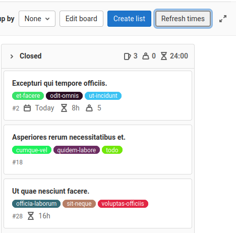

# GitLab time userscript

GitLab UserScripts to enhance usability:

Add total time to header of lists on GitLab boards

# How to use

* Install this script: https://greasyfork.org/scripts/430859-gitlab-total-timeInstall
* goto a borad and check if exists any issue with estimate time
* Click on "refresh times"
* Be happy!